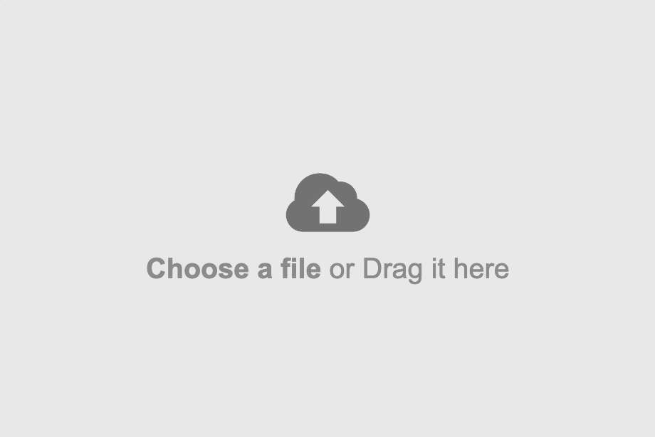

## Projeto DreamHouses - v3.0
### Adicionar a casa a partir do fomulário existente em `add.html`

- Nesta versão, iremos implementar o cadastro das informações das casas existentes no `array` a
  partir do formulário de `add.html`
- Primeiramente, observe que há um arquivo CSS `add.css` que já contém regras CSS para ajustar a
  aparência do formulário existente em `add.html`.

- Faça com que o arquivo `add.html` referencie o arquivo CSS `add.css`

```html
        <link rel="stylesheet" href="css/add.css">
```
- Faça com que o arquivo `add.html` também referencie o arquivo que contém as funções utilitárias de
  acesso aos dados das casas `houses-array.js`

```html
        <script src="scripts/houses-array.js" defer></script>
```
- Faça com que o arquivo `add.html` referencie o arquivo JavaScript `add.js` que irá conter
  apenas as funções que dizem respeito à adição das casas

```html
        <script src="scripts/add.js" defer></script>
```

- No final, o arquivo `add.html` deve ficar assim:

```html
<!DOCTYPE html>
<html lang="pt">

    <head>
        <meta charset="UTF-8">
        <meta name="viewport" content="width=device-width, initial-scale=1.0">
        <title>Add New House</title>
        <link rel="stylesheet" href="css/add.css">
        <script src="scripts/houses-array.js" defer></script>
        <script src="scripts/add.js" defer></script>
    </head>

    <body>
        <h1>Add a New House</h1>
        <hr>
        <div id="divCenter">
            <div id="divLeft">
                <div id="divUploadImage">
                    
                </div>
                <input type="file" id="fileInput" accept="image/*">
            </div>
            <div id="divFormHouseData">
                <form id="addHouseForm">

                    <input type="text" id="inputAddress" size=70
                        placeholder="Type address here, street, suite, apt. #, etc." required><br><br>

                    <hr>

                    <table>
                        <tr>
                            <td><label for="inputPrice">Price</label></td>
                            <td><input type="text" id="inputPrice" size=20 placeholder=" $650,000 e.g.," required>
                            </td>
                        </tr>
                        <tr>
                            <td><label for="inputBedrooms">Bedrooms</label></td>
                            <td><input type="number" id="inputBedrooms" size=70 placeholder=" 4" required>
                            </td>
                        </tr>
                        <tr>
                            <td><label for="inputBathrooms">Bathrooms</label></td>
                            <td><input type="number" id="inputBathrooms" size=70 placeholder=" 1" required>
                            </td>
                        </tr>
                        <tr>
                            <td><label for="inputSquareFeet">Square Feet</label></td>
                            <td><input type="number" id="inputSquareFeet" size=70 placeholder=" 2500" required>
                            </td>
                        </tr>
                    </table>
                    <hr>

                    <p id="parDescription"><label for="txtAreaDescription">Description</label></p>
                    <textarea id="txtAreaDescription" rows="6" cols="70"
                        placeholder="Type a description here, e.g, 'Modern home with a lovely garden and a garage.' "></textarea>
                    <hr>
                </form>
                <p>
                    <button id="btnAddHouse" type="button">Add House</button>
                </p>
            </div>
        </div>

        <p><a href="index.html">Back to main page</a></p>
    </body>

</html>
```

### Funções do arquivo `add.js`

- Agora, vamos implementar novas funções em `add.js`

- Primeiro, apenas estude com atenção a função `function addHouseEventHandler()`. Faça com que, no
  clique do botão de adicionar uma casa, esta função seja chamada.

```html
<!-- no arquivo add.html -->
<button id="btnAddHouse" type="button" onclick="addHouseEventHandler()">Add House</button>
```

#### A função `addHouseEventHandler()`
- Agora, note que, para adicionar uma casa, a `function addHouseEventHandler()` deve:

    1- criar um  objeto casa contendo todos os dados digitados pelo usuário no formulário HTML.

    2- usar a função `addHouseData()` do arquivo `houses-array.js`, para adicionar a nova casa no
    `array` de dados

    3- por fim, redirecionar o usuário para a página de listagem `list.html`. Logo, o usuário verá a
    casa recém-criada na listagem das casas.

- O protótipo:

```javascript
function addHouseEventHandler() {
	const house = createHouseFromHTMLForm(); // deve criar um objeto casa a partir dos dados do formulário HTML
	addHouseData(house); // função já pronta no houses-data.js que adiciona o objeto casa no array de dados

	location.href = "list.html"; // Redirecionar para página de listagem
}
```

#### A função `createHouseFromHTMLForm()`

- Esta função deverá criar um objeto casa a partir dos dados obtidos do formulário de `add.html`.
  Ela deve:

    1- Ler os dados que o usuário digitou no formulário

    2- Criar um novo objeto casa com os dados digitados do formulário

    3- Retornar o objeto casa recém-criado

- O protótipo:

```javascript
function createHouseFromHTMLForm() {
    // inicialmente, não haverá upload da imagem para um servidor; isso ficará para depois
    const houseThumbnail = 'https://i.ibb.co/NVjxzps/h4.jpg' || '<< No Image Url >>';
    const houseAddress = document.getElementById('inputAddress').value || '<< No Address >>';
    const housePrice = document.getElementById('inputPrice').value || '$ 0,00';
    const houseBedrooms = document.getElementById('inputBedrooms').value || '0';
    const houseBathrooms = document.getElementById('inputBathrooms').value || '0';
    const houseSquareFeet = document.getElementById('inputSquareFeet').value || '0';
    const houseDescription = document.getElementById('txtAreaDescription').value || '<< No Description >>'

    // uma função auxiliar 'construtor' de casas deve ser criada em houses-array.js
    const newHouse = new House(
        houseThumbnail,
        houseAddress,
        housePrice,
        houseBedrooms,
        houseBathrooms,
        houseSquareFeet,
        houseDescription
    );

    return newHouse;
}
```

#### A função construtora `new House`

- Esta função age como um construtor de casas. Ela recebe todos os dados de uma casa passados como
  argumentos e retorna um novo objeto casa.

- Para separar os papéis, ela usa outra função auxiliar apenas para formatar o preço da casa.

- O protótipo:

```javascript
// no arquivo houses-arrays.js
function House(thumbnail, address, price, bedrooms, bathrooms, squareFeet, description) {
    this.id = getAndIncrementHouseId();
    this.thumbnail = thumbnail;
    this.address = address;
    this.price = formatCurrencyUSDDollar(price); // função auxiliar abaixo
    this.bedrooms = bedrooms;
    this.bathrooms = bathrooms;
    this.squareFeet = squareFeet;
    this.description = description;
}

function formatCurrencyUSDDollar(price) {
    const formattedCurrency = new Intl.NumberFormat('en-US', {
        style: 'currency',
        currency: 'USD',
        minimumFractionDigits: 0
    }).format(Number(price));

    return formattedCurrency;
}
```

#### Dever de casa:

- Você deve implementar a funcionalidade de __editar__ os dados de uma casa a partir do botão
  existente na página de listagem das casas.

- Lembre-se de que, ao editar os dados de uma casa em um formulário HTML, os novos dados da casa também
devem ser atualizados no array de `sessionStorage` a partir do `houseId` da casa.

- Você pode reutilizar parte do código de `add.html` para criar uma nova página HMTL para edição de dados
  de uma casa existente:
    - O título deve ser `Edit House Data`
    - Importante: ao abrir este HTML, os dados da casa original devem ser pré-preenchidos nos campos do
      formulário HTML.